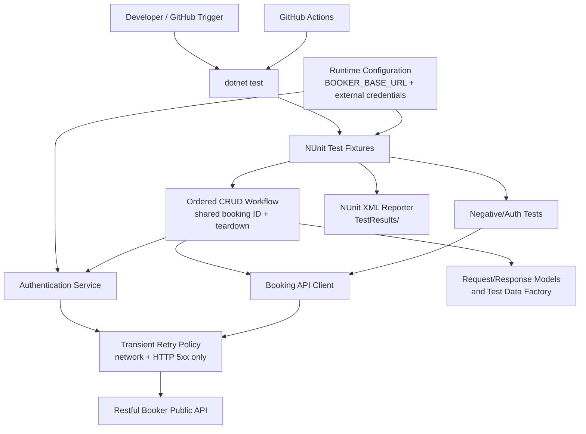

# Architecture: Restful Booker Automated API Test Suite

## Overview

The solution is a single .NET 8 NUnit API-test project using RestSharp. It
separates runtime configuration, authentication, HTTP-client behavior,
API-specific clients, request/response models, test-data generation, retry
behavior, NUnit fixtures, reporting, and CI adapters.

The test suite defaults to `https://restful-booker.herokuapp.com` and uses
`BOOKER_BASE_URL` when supplied. Authentication credentials are externally
supplied. If they are unavailable, fixtures requiring authentication are
explicitly skipped and the reason is emitted in the NUnit XML report.

The booking CRUD scenario is intentionally an ordered workflow: setup creates
one booking, subsequent tests share its booking ID, and teardown attempts to
delete it when it remains.

## Component Diagram

**Legend**

- **Runtime Configuration** resolves the default or overridden API URL and
  external authentication inputs.
- **NUnit Test Fixtures** contain test scenarios and emit NUnit XML results.
- **Ordered CRUD Workflow** creates, reads, fully updates, partially updates,
  deletes, and verifies deletion of one shared booking.
- **Negative/Auth Tests** verify expected 404 and invalid/missing-token
  response behavior.
- **Retry Policy** retries only transient network faults and HTTP 5xx
  responses up to two times.
- **Authentication Service / Booking API Client** isolate Restful Booker API
  interactions from test assertions.
- **Models / Test Data Factory** represent requests and responses and produce
  valid test inputs.
- **CI adapters** execute the same `dotnet test` command and publish the
  result artifact.

## Component Responsibilities

| Component | Responsibilities |
|---|---|
| `TestSettings` / configuration provider | Resolve the default API URL; override it from `BOOKER_BASE_URL`; validate missing/invalid configuration; read credentials only from approved external sources. |
| Authentication service | Request a Restful Booker token when credentials exist; prevent credential/token logging; provide a clear reason when authenticated tests must be skipped. |
| Retry executor | Retry network and HTTP 5xx failures up to two times only for safe/idempotent operations by default. Do not automatically retry POST, PUT, or PATCH without an approved idempotency strategy. Never retry expected 4xx assertions. |
| Booking API client | Encapsulate RestSharp calls for create, retrieve, full update, partial update, and delete operations. |
| API request/response models | Provide typed representations of auth, booking, booking-date, and booking-ID payloads. |
| Test-data factory | Build valid and controlled request data without embedding credentials or uncontrolled test state. |
| Ordered CRUD fixture | Own one shared booking ID and execute the approved lifecycle sequence in a non-parallelized NUnit fixture. Perform cleanup in teardown when the booking remains. |
| Negative/auth fixtures | Assert non-existent booking 404 responses and invalid/missing-token 401/403 responses. |
| NUnit reporting configuration | Emit NUnit XML files to `TestResults/` for local and CI consumption. |
| GitHub Actions adapter | Define `.github/workflows/api-tests.yml` to run tests for Pull Requests and manual dispatch, then publish NUnit XML artifacts. |

## Technology Choices & Rationale

| Technology | Rationale |
|---|---|
| C# / .NET 8 | Required by the approved requirements; provides the runtime and CLI execution through `dotnet test`. |
| NUnit | Required test framework; supports structured fixtures, ordered workflow tests, setup/teardown, skipped tests, and NUnit XML reporting. |
| RestSharp | Required HTTP client; isolates REST requests behind API-specific clients. |
| NUnit XML | Required machine-readable report format; stored under `TestResults/` and uploaded by the GitHub Actions workflow. |
| GitHub Actions | Required workflow implementation for Pull Request events and manual dispatch. |

## Data Flow

1. A developer runs `dotnet test`, or GitHub Actions triggers the same
    command from the canonical GitHub repository.
2. GitHub Actions runs the same command for Pull Requests and manual
    dispatch.
3. Runtime configuration selects the default API URL or reads
    `BOOKER_BASE_URL`.
4. The configuration provider resolves external credentials.
5. If credentials are absent, authenticated fixtures are marked skipped with a
    clear reason; unauthenticated tests may still run.
6. When credentials exist, the authentication service requests a token.
7. The ordered CRUD fixture creates a booking and retains its booking ID for
    later workflow steps.
8. The fixture retrieves, fully updates, partially updates, deletes, and
    finally verifies HTTP 404 for the same booking.
9. Negative/auth fixtures call the booking client with non-existent IDs or
    invalid/missing tokens and assert expected 4xx responses.
10. The retry executor retries only transient network or HTTP 5xx responses up
    to two times.
11. NUnit writes XML output into `TestResults/`.
12. GitHub Actions uploads the report as a workflow artifact.

## Assumptions & Risks

| Item | Status / mitigation |
|---|---|
| Public API availability and stability | Risk: the shared public demo API can be unavailable, rate-limited, or modified. Mitigation: limited retry only for transient network/5xx faults; do not mask expected assertion failures. |
| Ordered shared-state workflow | Intentional requirement. Risk: a failed setup can block dependent workflow steps. Mitigation: fixture setup must fail clearly; teardown must attempt cleanup only when a booking ID exists. |
| Missing authentication credentials | Approved behavior: mark authenticated tests as skipped with a clear NUnit XML reason; do not fail the run. |
| Exact credential variable names | **Not Found.** Resolve before implementation; no credentials may be hardcoded. |
| GitHub Actions secret names and storage | **Not Found.** Resolve before CI implementation; use GitHub's protected secret mechanism. |
| .NET 8 SDK availability | **Not Found** in the current environment. Install the SDK before Phase 5; runtime availability alone is insufficient to create/build a .NET 8 test project. |
| GitHub repository URL | https://github.com/charan-k/RestfulBroker.git. Canonical repository is now resolved for the Phase 5 Git preflight. |
| CI report retention period | **Not Found.** Configure an explicit retention duration when CI files are implemented. |
| Maximum suite duration | **Not Found.** Define a target if CI runtime limits are needed. |
| GitHub Actions execution topology | Approved: the canonical GitHub repository runs directly in GitHub Actions for Pull Request and manual-dispatch triggers. |
| NUnit XML logger | **Not Found.** Select a compatible logger package and exact `dotnet test` command before implementation so `TestResults/` receives the required XML artifact. |
| Missing credentials in CI | Authenticated tests are skipped by approved requirement. Mark the CI run as degraded when this occurs. **Not Found:** whether protected/release branches must fail instead. |
